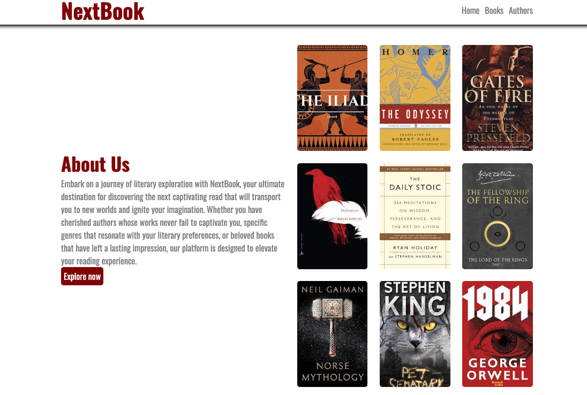

# React App NextBook

A fictional website that helps you decided what book to read next.

To run/load app use 'npm start' in terminal from the main project directory.
Open [http://localhost:3000] to view it in your browser. (if it doesnt load automatically.)

## Functionality;
- All home screen buttons work, with routing to correct locations (Books => books page ect.)
- NextBook title works as a home button from any screen.
- Page is interactive, a burger icon will appear (top right corner) when screen width is condensed. Clicking this will load an interactive sidebar.
- All pages and elements move/interact based off screen size.
- Books and Authors pages "update" each refresh.

## Future improvements/implementations; (practice pjoject/time decisions)
- External API's to generate books, authors and the details/descriptions/images for said book/author.
- Search function, and storage of previous searches.
- Log in feature, to save your books/searches.